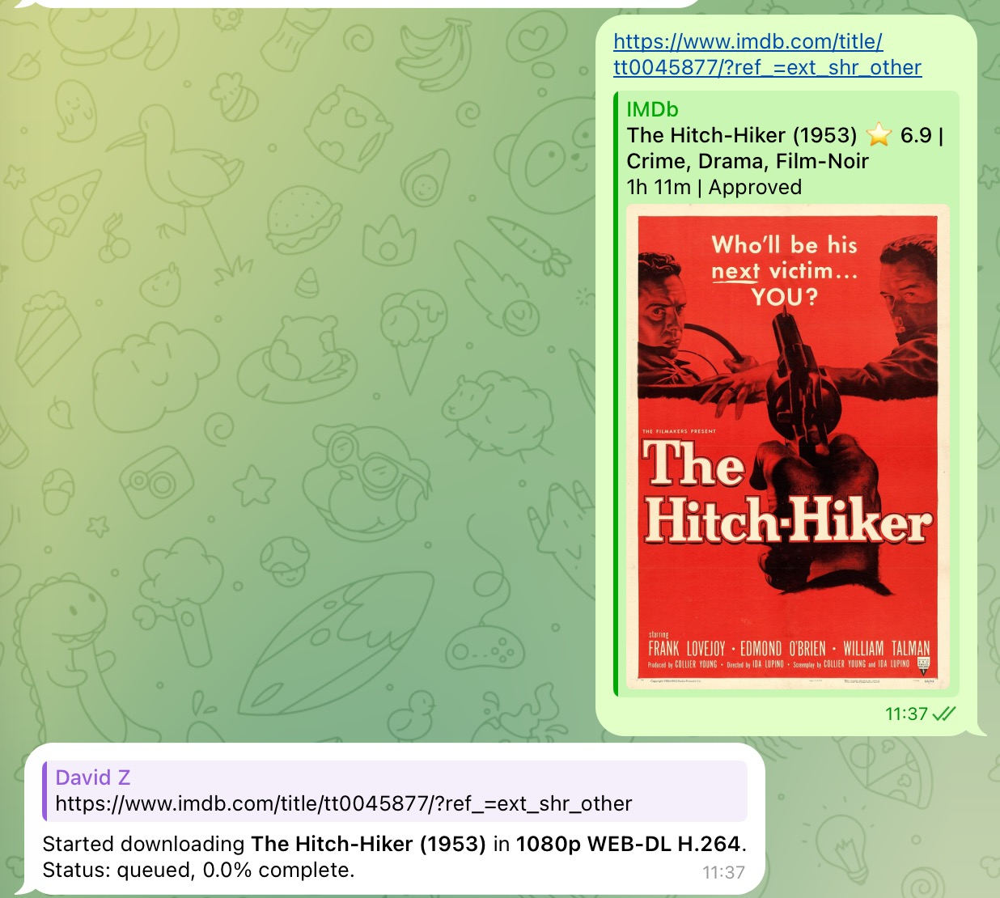
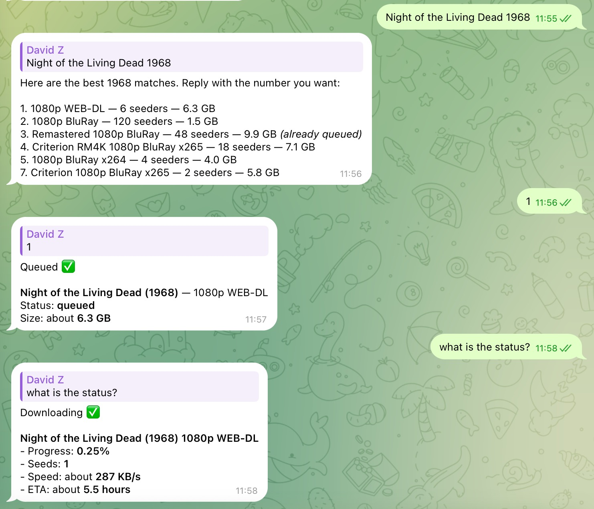

# qBitlarr

**Language:** English | [中文](README.zh-CN.md) | [Français](README.fr.md)

**A Prowlarr → qBittorrent bridge with REST, MCP, and CLI support.**

For people who already run Plex, Jellyfin, or Emby and want a lightweight way to let friends, family, or an LLM agent request movies and TV — without giving them qBittorrent access and without running the full Sonarr + Radarr stack.

qBitlarr is one small FastAPI service that:

- Takes a natural-language request, an IMDb ID, or an IMDb URL.
- Searches your Prowlarr indexers.
- Picks the best release using opinionated, configurable quality preferences.
- Queues it in your existing qBittorrent.
- Exposes everything as REST, MCP, and a small CLI so it drops into Claude Desktop, Cursor, ChatGPT custom tools, Telegram bots, shell scripts, cron jobs, or your own agent.

Works with any HTTP client, Claude/Cursor/ChatGPT via MCP, or the `qbitlarr` CLI.

## Architecture


Editable source for the REST / MCP / CLI diagram: [docs/architecture.svg](docs/architecture.svg).

## What Runs In Docker Compose

- `qbitlarr` — the FastAPI service on `http://localhost:8000`
- `prowlarr` — bundled Prowlarr on `http://localhost:9696`
- `flaresolverr` — bundled FlareSolverr on `http://localhost:8191`

qBittorrent is **not** bundled. Point qBitlarr at any existing qBittorrent — desktop, NAS, seedbox, separate container — via `QBIT_URL`, `QBIT_USERNAME`, `QBIT_PASSWORD`.

## qBittorrent Setup

qBitlarr needs an existing qBittorrent install because everyone saves media in different places: a desktop app, a NAS, a seedbox, or a separate container. qBitlarr only talks to qBittorrent through its Web UI API.

Before starting qBitlarr:

1. Install qBittorrent wherever your downloads should run.
2. In qBittorrent, open **Preferences / Options → Web UI** and enable the Web User Interface.
3. Set or confirm the Web UI username and password.
4. Put those values in `.env`:

```sh
QBIT_URL=http://host.docker.internal:8080
QBIT_USERNAME=your-webui-username
QBIT_PASSWORD=your-webui-password
```

Use `http://host.docker.internal:8080` when qBittorrent runs on the same machine as Docker Compose. If qBittorrent runs on a NAS, seedbox, or another computer, use that machine's LAN URL instead, such as `http://192.168.1.50:8080`. Do not use `localhost` in `.env` for a host-installed qBittorrent; from inside Docker, `localhost` means the qBitlarr container itself.

## Quick Start

```sh
cp .env.example .env
# edit .env: set QBIT_URL, QBIT_USERNAME, QBIT_PASSWORD from your qBittorrent Web UI

# 1. Start Prowlarr first so you can grab its API key
docker compose up -d prowlarr flaresolverr

# 2. Open http://localhost:9696, finish first-run setup, add indexers,
#    then copy the API key from Settings -> General -> Security
# 3. Put the key in .env as PROWLARR_API_KEY

# 4. Start the rest
docker compose up -d --build

# 5. Try it
curl -X POST http://localhost:8000/handle \
  -H 'Content-Type: application/json' \
  -d '{"user_message":"tt0045877"}'
```

For a dependency check that also pings Prowlarr and qBittorrent:

```sh
curl 'http://localhost:8000/health?deep=true'
```

## What It Feels Like

Once qBitlarr is wired up to your agent (or you're using the CLI), you talk to it the way you'd talk to a friend who knows your media setup:

The examples below use [The Hitch-Hiker (1953)](https://www.imdb.com/title/tt0045877/), a public-domain film listed by the Library of Congress in its [Public Domain Films from the National Film Registry](https://www.loc.gov/free-to-use/public-domain-films-from-the-national-film-registry/) set. Rights can still vary by jurisdiction and by specific restoration, soundtrack, subtitles, or edition.

<table>
  <tr>
    <td width="50%">
      
      <br>
      <em>Screenshot example for reference only. The base title shown is a Public Domain example; rights can vary by jurisdiction and by specific restoration, soundtrack, subtitles, or edition.</em>
    </td>
    <td width="50%">
      
      <br>
      <em>Screenshot example for reference only. The base title shown is a Public Domain example; rights can vary by jurisdiction and by specific restoration, soundtrack, subtitles, or edition.</em>
    </td>
  </tr>
</table>

> **You:** *Download The Hitch-Hiker.*
> **Agent:** Started auto-downloading The Hitch-Hiker in 1080p WEB-DL H.264.

> **You:** *Download tt0045877 from IMDb.*
> **Agent:** Started auto-downloading The Hitch-Hiker in 1080p WEB-DL H.264.

> **You:** *I want The Hitch-Hiker in 4K.*
> **Agent:** Started auto-downloading The Hitch-Hiker in 2160p UHD BluRay REMUX H.265.

> **You:** *What's downloading right now?*
> **Agent:** The Hitch-Hiker — 42% — downloading at 8.4 MB/s · ETA 6 minutes

> **You:** *Find me The Hitch-Hiker, but I want to pick the release.*
> **Agent:** Here are the top results — reply with the number:
>   1. The.Hitch-Hiker.1953.1080p.WEB-DL.H.264 — 152 seeders
>   2. The.Hitch-Hiker.1953.720p.BluRay.H.264 — 84 seeders
>   3. The.Hitch-Hiker.1953.DVDRip.H.264 — 60 seeders

Behind the scenes: when the agent gets a clear title, it auto-picks the best 1080p release that has enough seeders and queues it in your qBittorrent. When the title is ambiguous (just a free-text search), it returns a ranked list and waits for your pick. Status answers come from `qbitlarr_list_downloads`, which streams the live qBittorrent state — progress, speed, ETA, seeders. You can always say *"4K"*, *"Remux"*, or *"720p HEVC"* to override the default quality.

### Pro tip: share straight from the IMDb app

The fastest way to use qBitlarr is to skip typing the title:

1. In the IMDb app (or any site that shows an IMDb URL), find what you want.
2. Tap the share icon → pick the chat app where your agent lives (Telegram, WhatsApp, Discord, Signal, iMessage, etc.).
3. The agent receives a URL like `https://www.imdb.com/title/tt0045877/` and auto-identifies the title — no typing, no spelling traps, no ambiguity.

A raw IMDb ID like `tt0045877` works the same way if you have one handy. qBitlarr extracts the ID, runs a precise lookup against your indexers, and queues the best match in seconds.

## When To Use This vs Sonarr / Radarr

Use **Sonarr/Radarr** if you want a library manager: episode tracking, upgrade policies, automatic monitoring of new releases, quality profiles with 30 knobs.

Use **qBitlarr** if you just want: *"a friend says a movie name → it appears on Plex an hour later."* No library, no monitoring, no profile UI. One service, four env vars for preferences, done.

## Responsible Use

qBitlarr is an automation bridge. It does not provide content, indexers, trackers, or legal advice. Use it only with indexers and media you are allowed to access in your jurisdiction.

## Setting Up Indexers In Prowlarr

If this is your first time meeting **Prowlarr**: it's an *indexer aggregator*. It connects to a bunch of torrent sites (called "indexers") and gives qBitlarr one unified search API. Without it, qBitlarr would have to know how to talk to dozens of different sites with their own quirks — Prowlarr is the layer that hides all that. Add indexers once, and every qBitlarr search hits all of them in parallel.

**Adding an indexer:**

1. Open `http://localhost:9696` and go to **Indexers → + Add Indexer**.
2. Type the indexer name in the filter.
3. **Public indexer**: usually just click **Save** — no login needed.
4. **Private tracker**: paste the cookie / API key / passkey from your account on that tracker. Each tracker has slightly different fields and Prowlarr's form tells you what's needed.
5. Hit **Test** to confirm Prowlarr can reach it, then **Save**.
6. The indexer now has a numeric ID, discoverable via `curl http://localhost:8000/prowlarr/indexers`.

For any indexer behind Cloudflare, also tag it with the `flaresolverr` proxy — see [Why FlareSolverr Is Bundled](#why-flaresolverr-is-bundled) just below.

**Public vs private trackers:**

- **Public indexers** are usually quick to add but often have lower signal-to-noise: more dead torrents, spam, and fake releases.
- **Private trackers** require an account and often have stricter access rules. Their setup fields vary; follow the requirements of trackers you are allowed to use.

**Recommendations:**

- **Start with 2–4 indexers, not 20.** Every indexer adds latency to every search — one slow site can bottleneck the whole thing, and stacking public indexers mostly stacks noise, not signal.
- **Mix coverage with quality.** One or two broad public indexers as a safety net, plus any private trackers you have access to, is a solid baseline.
- **Skip `Sync Profiles`** unless you also run Sonarr or Radarr — qBitlarr doesn't need them.

Once indexers are in place, optionally set primary vs fallback IDs in [Indexer Selection](#indexer-selection) so qBitlarr searches your fast trusted indexers first and only falls back to slower or noisier ones when needed.

## Why FlareSolverr Is Bundled

Some popular indexers sit behind **Cloudflare's anti-bot challenge**. A plain HTTP request — what Prowlarr makes by default — gets an HTML challenge page instead of search results, and the indexer effectively returns nothing.

**FlareSolverr** is a tiny headless-Chrome proxy that solves those challenges for Prowlarr. When Prowlarr is configured to route certain indexers through it, FlareSolverr opens the page in a real browser, waits for Cloudflare to pass, and hands the cookies back to Prowlarr so the actual search API call succeeds.

qBitlarr bundles it because the moment a user adds a Cloudflare-protected indexer to Prowlarr, they hit this wall — and the official fix is "install FlareSolverr separately." Shipping it in the compose file removes that footgun.

**How to wire it up in Prowlarr** (one-time, after first start):

1. Open Prowlarr at `http://localhost:9696`.
2. Go to **Settings → Indexers → Indexer Proxies**.
3. Click the **+** and pick **FlareSolverr**.
4. Set **Host** to `http://flaresolverr:8191` (the internal compose hostname) and give it a **Tag** like `flaresolverr`.
5. Save. Then on any Cloudflare-protected indexer, open it, add that same `flaresolverr` tag, and save.

Indexers without the tag bypass FlareSolverr entirely — there's no performance penalty for non-protected sites. If you don't use any CF-protected indexers, you can stop the container (`docker compose stop flaresolverr`) and qBitlarr keeps working.

## Quality Preferences

By default qBitlarr targets **1080p WEB-DL H.264** with at least 5 seeders. Change the defaults via env:

```sh
QBITLARR_PREFER_RESOLUTION=1080p   # 480p | 720p | 1080p | 2160p
QBITLARR_PREFER_SOURCE=WEB-DL      # WEB-DL | WEBRip | BluRay | HDTV
QBITLARR_PREFER_CODEC=H.264        # H.264 | H.265
QBITLARR_MIN_SEEDERS=5
```

End users override per-request just by saying so in natural language:

- `"The Hitch-Hiker 4K"` → forces 2160p
- `"The Hitch-Hiker Remux"` → forces a Remux release
- `"The Hitch-Hiker 720p HEVC"` → 720p H.265

## Output Modes

`POST /handle` accepts an optional `mode` field controlling what happens when an IMDb ID is given:

- `auto` *(default)* — pick the best release and queue it. Best for "set and forget" friends/family use.
- `manual` — always return a ranked list, never queue anything. Best for power users who want to choose.
- `confirm` — return the top pick and runner-ups, but do **not** queue. Best for agent flows that want user confirmation before committing.

Override the server-wide default with `QBITLARR_DEFAULT_MODE=auto|manual|confirm`. Auto-download responses always include an `alternatives` list with 2–3 runner-ups so an agent can offer "or did you mean..." without a second tool call.

## Connect To An Agent

qBitlarr ships as an **MCP server**, so any agent that speaks the [Model Context Protocol](https://modelcontextprotocol.io) — Claude Desktop, Cursor, Cline, Hermes, OpenClaw, ChatGPT via an MCP bridge, your own custom agent — can use it.

The MCP tools are language-neutral. Users can ask in English, Chinese, French, or any language your agent's LLM handles; the agent can answer in the same language you use. That multilingual behavior depends on the LLM behind your agent, not on qBitlarr itself.

Two transports are available:

- **stdio MCP** — what most desktop agent apps want. They launch `bin/qbitlarr-mcp` as a subprocess.
- **HTTP MCP** — served at `http://localhost:8000/mcp` for hosts that prefer HTTP.

Tools exposed by both: `qbitlarr_handle`, `qbitlarr_search`, `qbitlarr_download`, `qbitlarr_list_downloads`, `qbitlarr_get_query_snapshot`, `qbitlarr_list_prowlarr_indexers`, `qbitlarr_health`.

If `QBITLARR_API_KEY` is set, both transports require an `X-API-Key` header. The stdio MCP picks it up from the same env var.

### Claude Desktop

Edit `~/Library/Application Support/Claude/claude_desktop_config.json` (macOS) or `%APPDATA%\Claude\claude_desktop_config.json` (Windows):

```json
{
  "mcpServers": {
    "qbitlarr": {
      "command": "/absolute/path/to/qbitlarr/bin/qbitlarr-mcp",
      "env": {
        "QBITLARR_API_URL": "http://localhost:8000",
        "QBITLARR_API_KEY": ""
      }
    }
  }
}
```

Restart Claude Desktop. The qbitlarr tools appear in the tool list and Claude uses them when you ask about movies or TV.

### Cursor

Settings → **MCP** → **Add new MCP server**:

```json
{
  "mcpServers": {
    "qbitlarr": {
      "command": "/absolute/path/to/qbitlarr/bin/qbitlarr-mcp"
    }
  }
}
```

### Any other MCP host (Hermes, OpenClaw, Cline, custom agents)

The pattern is the same — they all support one or both transports:

- **Stdio path**: configure the host to launch `bin/qbitlarr-mcp` as a subprocess (with env vars for the API URL and optional API key).
- **HTTP path**: point the host at `http://localhost:8000/mcp` with the `X-API-Key` header if you set one.

### Tell your agent when to use qBitlarr

If your agent supports a system prompt or "tool instructions" field, add a short pointer so it reaches for qBitlarr at the right moment:

> *When the user asks to download a movie, TV show, or anime that they are allowed to access, use the qbitlarr MCP tools. Default to `qbitlarr_handle` — it accepts IMDb IDs, IMDb URLs, and free-text titles, and decides whether to auto-pick or return a list. Only fall back to `qbitlarr_search` + `qbitlarr_download` when the user explicitly wants to choose from a list.*

This nudges agents that wouldn't otherwise know your downloader is now an option.

### Quick sanity check

After wiring it up, ask the agent: *"Use qbitlarr_health to check that the service is up."* If it returns `{"status": "ok"}`, you're connected. Add `--deep` (or pass `deep: true`) to verify Prowlarr and qBittorrent are reachable too.

## CLI

The CLI is a thin client for the same REST API used by MCP. It reads `QBITLARR_API_URL`, `QBITLARR_API_KEY`, and `QBITLARR_API_TIMEOUT_SECONDS` from the environment, with flags available for overrides.

`handle` prints a friendly human response by default. Add `--json` when you want the raw structured response. Other subcommands print JSON by default for use with `jq`.

```sh
bin/qbitlarr handle "tt0045877"
bin/qbitlarr handle "The Hitch-Hiker" --mode manual
bin/qbitlarr handle "The Hitch-Hiker" --mode manual --json
bin/qbitlarr search --query "The Hitch-Hiker 1953 1080p" | jq '.[0]'
bin/qbitlarr download 'magnet:?xt=urn:btih:...'
bin/qbitlarr downloads --watch
bin/qbitlarr health --deep
bin/qbitlarr indexers
```

Quote magnet links in your shell because they often contain `&`.

Inside the Docker container, run the same CLI module with `docker compose exec qbitlarr python -m app.cli health --deep`. The `bin/qbitlarr` launcher is for host checkout use.

## Authentication

For deployments beyond localhost, set `QBITLARR_API_KEY`. Every REST and MCP request then needs the `X-API-Key` header:

```sh
curl -H 'X-API-Key: change-this' http://localhost:8000/health
```

Leave blank for unauthenticated local-only use.

## Prowlarr URLs

`PROWLARR_URL` is the URL qBitlarr uses for Prowlarr API calls. In Docker Compose it defaults to `http://prowlarr:9696`, the internal service hostname — most users don't need to change this.

`PROWLARR_DOWNLOAD_URL` is optional. Set it only when Prowlarr returns proxy download URLs that qBitlarr must rewrite before fetching the `.torrent` file, for example when qBitlarr must reach Prowlarr through a LAN address instead of the internal Docker hostname.

## Indexer Selection

`PROWLARR_PRIMARY_INDEXER_IDS` and `PROWLARR_FALLBACK_INDEXER_IDS` are optional comma-separated indexer IDs.

- Leave both blank to let Prowlarr search every applicable indexer.
- Set primary IDs to prefer a trusted subset first.
- Set fallback IDs for broader or slower indexers to try only when primary results are missing or unsuitable.

Discover IDs after Prowlarr is configured:

```sh
curl http://localhost:8000/prowlarr/indexers
```

## Save Paths

`/handle` auto-downloads route based on media type and resolution:

- `QBITLARR_SAVE_PATH_MOVIE=/downloads/movies`
- `QBITLARR_SAVE_PATH_MOVIE_4K=/downloads/movies-4k`
- `QBITLARR_SAVE_PATH_TV=/downloads/tv`

Both `/handle` and `/download` also accept an optional `save_path` field for one-off overrides. Overrides must be inside one of the configured roots above or inside a comma-separated `QBITLARR_EXTRA_SAVE_PATHS` entry, such as `/media/Kids`.

When `save_path` is omitted, `/handle` and `/download` use qBitlarr's configured defaults. `/download` infers the target from the torrent metadata or magnet display name, so manual selections from search results still land in the movie, 4K movie, or TV path instead of qBittorrent's global default download folder.

## REST API

| Method | Path | Purpose |
| --- | --- | --- |
| GET | `/health` | Service liveness |
| GET | `/health?deep=true` | Liveness + Prowlarr/qBittorrent reachability |
| POST | `/handle` | Main entry point: search and (optionally) queue |
| POST | `/search` | Raw Prowlarr search |
| POST | `/download` | Queue a known download link |
| GET | `/downloads` | List torrents in qBittorrent |
| GET | `/queries/{query_id}` | Re-read a saved search snapshot |
| GET | `/prowlarr/indexers` | List Prowlarr indexers with IDs |

Example: queue a known link to a specific folder.

```sh
curl -X POST http://localhost:8000/download \
  -H 'Content-Type: application/json' \
  -d '{"download_link":"magnet:?xt=urn:btih:...","save_path":"/media/Kids"}'
```

## Project Structure

```
qbitlarr/
├── app/                          FastAPI service — the canonical implementation
│   ├── main.py                   App entry point, mounts routers + HTTP MCP at /mcp
│   ├── config.py                 Env-var settings (Prowlarr, qBittorrent, preferences)
│   ├── models.py                 Pydantic request/response schemas
│   ├── exceptions.py
│   ├── client.py                 Async HTTP client (shared by CLI and MCP)
│   ├── cli.py                    `qbitlarr` argparse CLI
│   ├── api/                      REST endpoint handlers
│   │   ├── handle.py             /handle — the main orchestration: search → rank → queue
│   │   ├── search.py             /search — raw Prowlarr passthrough
│   │   ├── download.py           /download — queue a known link
│   │   ├── downloads_list.py     /downloads — qBittorrent status
│   │   ├── query_snapshots.py    /queries/{id} — saved search snapshots
│   │   └── prowlarr.py           /prowlarr/indexers — indexer discovery
│   ├── domain/                   Pure logic, no I/O
│   │   ├── quality.py            Title parsing, scoring, QualityPreferences
│   │   ├── search_results.py     Prowlarr result normalization
│   │   └── torrent_metadata.py   .torrent file decoding for verification
│   └── services/                 External-service clients
│       ├── prowlarr.py
│       ├── qbittorrent.py
│       └── query_snapshots.py
├── mcp_server/
│   └── server.py                 stdio MCP server — thin wrappers around app/client.py
├── bin/
│   ├── qbitlarr                  Launcher for the CLI
│   └── qbitlarr-mcp              Launcher for the stdio MCP server
├── tests/                        pytest suite
├── docs/
│   ├── architecture.png
│   ├── architecture.svg
│   └── screenshots/              README screenshots
├── docker-compose.yml            Bundles qbitlarr + prowlarr + flaresolverr
├── Dockerfile                    Builds the qbitlarr image
├── requirements.txt
├── .env.example                  Copy to .env and fill in
├── README.md                     English README
├── README.zh-CN.md               Simplified Chinese README
└── README.fr.md                  French README
```

**Where things live:**

- **`app/api/handle.py`** is where the interesting logic happens — IMDb detection, primary/fallback indexer cascade, ranking, mode handling (`auto`/`manual`/`confirm`).
- **`app/domain/quality.py`** is the pure scoring/ranking layer — no network calls. Tune this if you want to change *how* releases are picked.
- **`app/client.py`** is the only HTTP client. Both the CLI (`app/cli.py`) and the stdio MCP (`mcp_server/server.py`) call into it, so behavior stays consistent across interfaces.
- **The REST API is the canonical surface.** MCP and CLI are both clients of it. If you're embedding qBitlarr in another system, hit the REST endpoints directly.

## Third-Party Projects

qBitlarr integrates with these third-party projects:

- **[Prowlarr](https://github.com/Prowlarr/Prowlarr)** — GPL-3.0. qBitlarr can run Prowlarr as a separate Docker Compose service and talks to it through its HTTP API.
- **[qBittorrent](https://github.com/qbittorrent/qBittorrent)** — GPL-2.0. qBitlarr expects you to provide qBittorrent separately and talks to it through its Web UI API.
- **[FlareSolverr](https://github.com/FlareSolverr/FlareSolverr)** — MIT. qBitlarr's Docker Compose setup includes it as an optional challenge proxy for Prowlarr indexers that need it.

qBitlarr is not affiliated with, endorsed by, or sponsored by Prowlarr, qBittorrent, FlareSolverr, or their maintainers.

## License

MIT.
